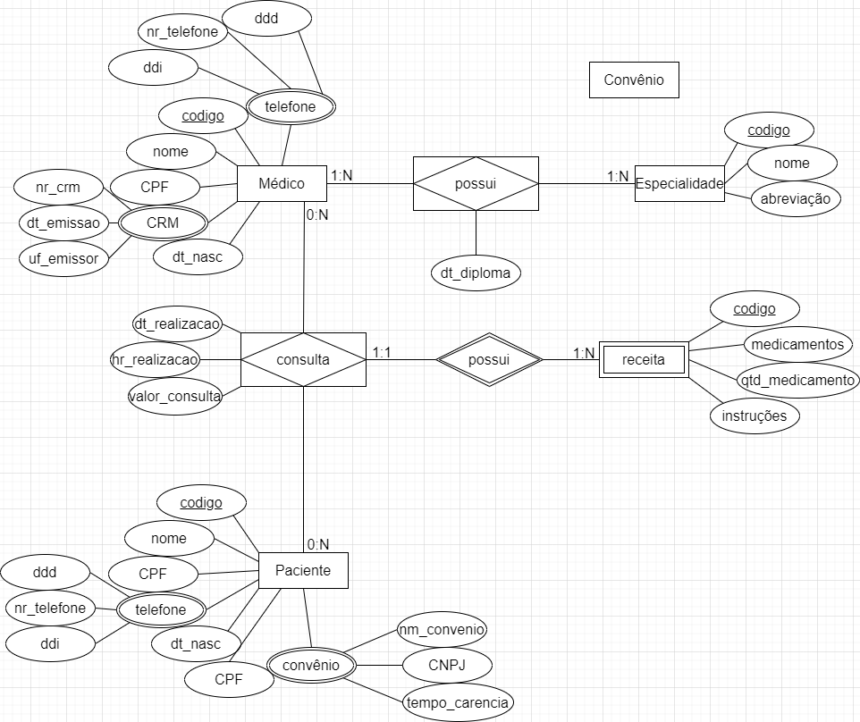
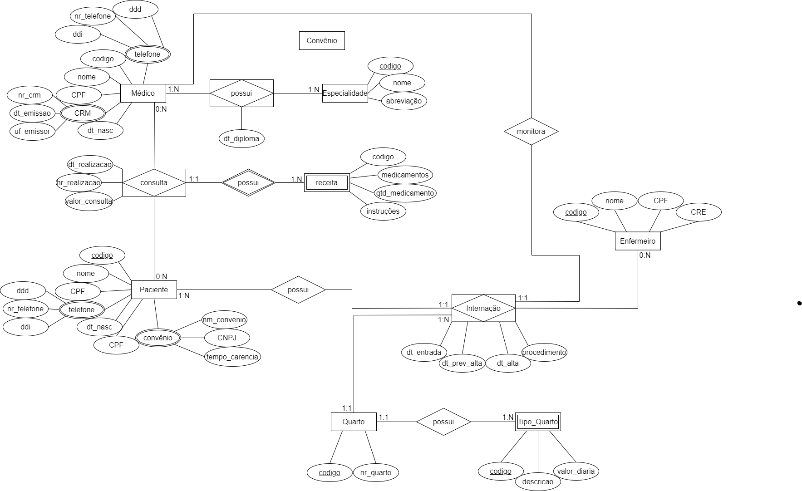
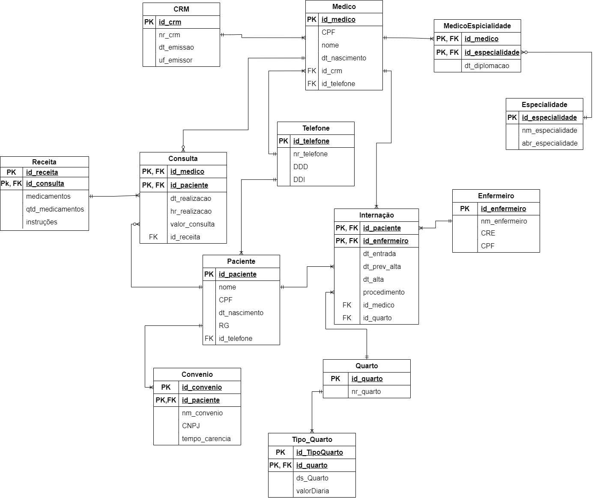

# **BancoDadosPROA**
Repositório com os diagramas e conceitos trabalhados nas aulas de banco de dados do Instituto PROA.

## Índice 

* [Diagrama1 - Hospital](#Diagrama1---Hospital)
* [Diagrama2 - Hospital Pt.2](#diagrama2---hospital-pt2)
* [Diagrama3 - Hospital Lógico](#diagrama3---hospital-lógico)
* [Codigo1 - Hospital Fisico](#codigo1---hospital-físico)
* [Codigo2 - Select Hospital Fisico](#codigo2---select-hospital-físico)

### Diagrama1 - Hospital:

 Um pequeno hospital local busca desenvolver um novo sistema que atenda melhor às suas necessidades. Atualmente, parte da operação ainda se apoia em planilhas e arquivos antigos, mas espera-se que esses dados sejam transferidos para o novo sistema assim que ele estiver funcional. Neste momento, é necessário analisar com cuidado as necessidades desse cliente e sugerir uma estrutura de banco de dados adequada por meio de um Diagrama Entidade-Relacionamento. O diagrama seguindo as necessidades está abaixo. 



### Diagrama2 - Hospital Pt.2:

 Após a primeira versão do projeto de banco de dados para o sistema hospitalar, notou-se a necessidade de expansão das funcionalidades, incluindo alguns requisitos essenciais a essa versão do software. As funcionalidades em questão são para o controle na internação de pacientes. Será necessário expandir o Modelo ER desenvolvido e montar o banco de dados, criando as tabelas para o início dos testes. As atualizações foram na criação das entidades de quartos, internação e enfermeiro.
 


### Diagrama3 - Hospital Lógico:

 Depois de refazer o modelo conceitual do hospital, dessa vez foi feita a modelagem lógica desse mesmo hospital, ela contém algumas tabelas comuns à bancos de dados como a tabela telefone, e ela também já possui como ficarão as chaves estrangeiras do banco de dados fisico. A cardinalidade foi feita utilizando os famosos pés de galinha!
 


### Codigo1 - Hospital Físico
Finalmente chagamos ao modelo físico do Hospital, a linguagem usada é o SQL, e a ferramenta de gerenciamento de banco de dados usada foi o MySQL Workbench. *Seja Bem vindo ao banco de dados do hospital! <3*

```SQL
CREATE DATABASE IF NOT EXISTS HOSPITAL;
USE HOSPITAL;
```

Depois de acessar e executar o script em <a href='ScriptSQL/hospital.sql'>hospital.sql</a>, é importante *inserir dados no nosso banco de dados!*

```SQL
INSERT INTO MEDICO 
VALUES (null, '1234567891', 'Fulano de Tal', DATE '2023-05-17', 1, '+5511999999999');
```

Ao acessar o script <a href='ScriptSQL/insertHospital.sql'>insertHospital.sql</a>, você terá acesso a algumas informações reais sobre o essa área hospitalar, como nome de médicos, crm e telefones verdadeiros de acordo até com as especialidades e datas de diplomação que foram cadastradas, é bem legal de observar a consistência da pesquisa feita na hora de consultar esses dados. Exemplo:

```SQL
select nr_crm, dt_emissaoCrm, uf_emissorCrm, nm_medico, 
telefoneMedico, dt_diplomacao,nm_especialidade 
from crm
inner join medico on medico.id_crmMedico=crm.id_crm
inner join medicoEspecialidade on medicoEspecialidade.id_medicoESP=medico.id_medico
inner join especialidade on medicoEspecialidade.id_especialidadeESP=especialidade.id_especialidade;
```

Esse script retornará uma tabela assim com todos os dados inseridos sobre os médicos:
<table>
<tr>
    <th>nr_crm</th>
    <th>dt_emissaoCrm</th>
    <th>uf_emissorCrm</th>
    <th>nm_medico</th>
    <th>telefoneMedico</th>
    <th>dt_diplomacao</th>
    <th>nm_especialidade</th>
  </tr>
  <tr>
    <td>47742</td>
    <td>1984-02-21</td>
    <td>SP</td>
    <td>Newton Nakamura</td>
    <td>+5520925999</td>
    <td>1983-12-20</td>
    <td>Pediatria</td>
  </tr>	
  <tr>
    <td>101092</td>
    <td>2000-12-19</td>
    <td>SP</td>
    <td>Juliana Mossini Nicoliello</td>
    <td>+55115083822</td>
    <td>2003-12-20</td>
    <td>Clínica Geral</td>
  </tr>
</table>

### Codigo2 - Select Hospital Físico

A última parte da tarefa diz respeito às consultas no banco de dados.

```SQL
select * from ... 
```

Exemplo de consulta cobrada na tarefa:

*1 - Todos os dados e o valor médio das consultas do ano de 2020 e das que foram feitas sob convênio.*
```SQL
select id_consulta, id_medicoCons, id_pacienteCons, dt_realizacaoCons, hr_realizacaoCons, valor_consulta, id_convenioCons
from consulta where dt_realizacaoCons>=DATE('2020-01-01');
select avg(valor_consulta) as media_consultas2020 from consulta where dt_realizacaoCons>=DATE('2020-01-01');
```